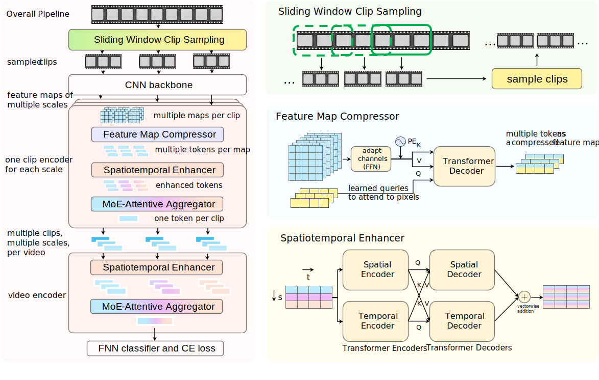
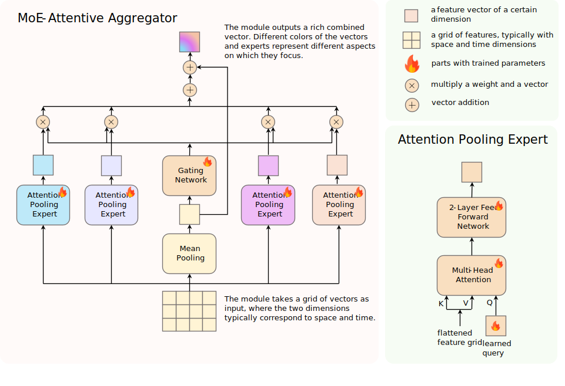

# 🎬 Hierarchical Representation with Clips Enabled by MoE-Attentive Aggregation for Weakly Supervised Group Activity Recognition

**(The paper has been submitted to The Visual Computer.)**

Official implementation of **"Hierarchical Representation with Clips Enabled by MoE-Attentive Aggregation for Weakly Supervised Group Activity Recognition"**.

<p align="center">
  <a href="https://github.com/rt-dev-design/HRCM-GAR">
    
  </a>
</p>

<p align="center">
  <a href="https://github.com/rt-dev-design/HRCM-GAR">
    
  </a>
</p>

---

## 🌟 Introduction

Weakly supervised group activity recognition (WSGAR) aims to recognize collective human activities using only group level labels, without human-annotated bounding boxes or person-level supervision. Recent work has relied on complex models and modalities over sparsely sampled frames, yet such approaches are costly and cannot recover critical information that was never observed in the first place.

To address this issue, we introduce a **clip-centric hierarchical representation framework** for WSGAR. Instead of reasoning mainly on isolated sparse frames, our method treats a **clip** as an intermediate unit between frame and video, enabling the model to capture dense and continuous spatiotemporal dynamics that are crucial for understanding group activities.

Our framework consists of a dedicated sampling strategy and a hierarchical network. 
* First, **Sliding Window Clip Sampling (SWCS)** densely samples short overlapping clips from the input video. 
* Then, the network progressively extracts and aggregates information **within clips** and **across clips** to produce a video-level representation for classification. 
* To better summarize feature grids appearing repeatedly in this hierarchy, we further propose a **MoE-Attentive Aggregator**, which adaptively combines multiple attention-based experts for more expressive and effective aggregation.

Experiments on **Volleyball** and **NBA** benchmarks show that our method outperforms prior weakly supervised RGB-only approaches and remains competitive with methods using stronger supervision or additional modalities.
> **[IMPORTANT REPRODUCIBILITY STATEMENT]**
> 
> To ensure full reproducibility, the source code and data for this work are made permanently available.

---

## ⚙️ Environment Setup

Create the conda environment and install dependencies:

```bash
conda create -n HRCM python=3.9 -y
conda activate HRCM
pip install -r requirements.txt
```

---

## 🧠 Training

Run with our tuned hyperparameters:
```bash
python {dataset}_script.py
```

---

## 🚀 Testing

Run with some checkpoint:
```bash
python {dataset}_script.py --run_test True --load_checkpoint True --checkpoint_path path_to_checkpoint
```

---

## 📂 Project Structure

```
HRCM-GAR/
├── dataset/                     # the SWCS data strategy and dataset loaders
│   ├── nba.py                   # entry to NBA loader
│   ├── volleyball.py            # entry to Volleyball loader
│   └── ...
├── models/                      # network modules
│   ├── zim.py                   # entry to the whole network
│   ├── zim_moe.py               # the MoE-Attentive module
│   └── ...
├── util/                        # utilities
├── figs/                        # figures and visualization
├── nba_script.py                # train or test on NBA
├── volleyball_script.py         # train or test on Volleyball
├── requirements.txt             # environment dependencies
└── README.md                    # project documentation
```

---

## 🧩 Key Components

| Module | Description |
|:--|:--|
| **Sliding Window Clip Sampling (SWCS)** | Densely samples overlapping short clips from a video, improving temporal coverage while keeping computation manageable. It serves as the data-side realization of the clip concept. |
| **Hierarchical Representation Network** | A two-stage architecture that first models dense spatiotemporal information within each clip, and then models interactions across clips and scales to build a video-level representation. |
| **MoE-Attentive Aggregator** | A cost-effective mixture-of-experts aggregation module that uses multiple attention-based experts and a gating mechanism to summarize feature grids more adaptively than mean/max pooling or single-query attention. |

---

## 📜 Citation

If you find this work useful in your research, please cite our work:

```latex
@article{Zheng2025HRCM,
  title={Hierarchical Representation with Clips Enabled by MoE-Attentive Aggregation for Weakly Supervised Group Activity Recognition},
  author={Zheng, Runtian and Zhang, Chengfang and Feng, Ziliang},
  journal={The Visual Computer},
  year={2025}
}
```
> **[IMPORTANT NOTE FOR READERS]**
> 
> This code is directly related to the manuscript submitted to The Visual Computer. We kindly urge readers to cite the relevant manuscript if they use this repository or its core methodologies in their research.
---

## 📬 Contact

For questions or collaboration opportunities, please contact:  
**Runtian Zheng** (Sichuan University)  
📧 Email: [zhengruntian@stu.scu.edu.cn](mailto:zhengruntian@stu.scu.edu.cn)

